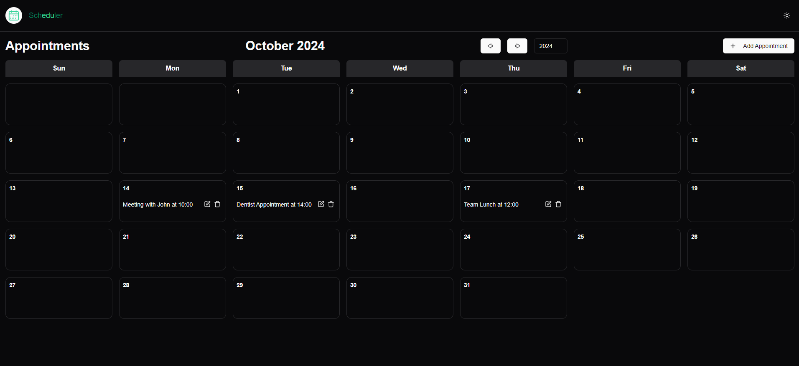

# Schedule-Next



## About the project

The **Schedule** project is an online agenda to detail meetings with the aim of facilitating the team's visualization, knowing at what time it would be most appropriate to request a call/technical conversation regarding a question/definition, among others.

## Technologies

### Backend

> [backend](https://github.com/lacerdence/Schedule/tree/main)

- Java
- Spring Boot

### Frontend

- Next
- tailwindcss
- shadcn/ui
- radix-ui

### Environment

- Docker

## Docker

This project uses containerization via docker, so the entire environment to run the project is already configured. Just run the following command in the terminal

```bash
docker-compose up
```

## Author

Carlos Alberto Martorini Silveira


<svg xmlns="http://www.w3.org/2000/svg" viewBox="0 0 24 24" data-supported-dps="24x24" fill="currentColor" class="mercado-match" width="24" height="24" focusable="false">
  <path d="M20.5 2h-17A1.5 1.5 0 002 3.5v17A1.5 1.5 0 003.5 22h17a1.5 1.5 0 001.5-1.5v-17A1.5 1.5 0 0020.5 2zM8 19H5v-9h3zM6.5 8.25A1.75 1.75 0 118.3 6.5a1.78 1.78 0 01-1.8 1.75zM19 19h-3v-4.74c0-1.42-.6-1.93-1.38-1.93A1.74 1.74 0 0013 14.19a.66.66 0 000 .14V19h-3v-9h2.9v1.3a3.11 3.11 0 012.7-1.4c1.55 0 3.36.86 3.36 3.66z"/>
</svg>

[Linkedin](https://www.linkedin.com/in/carlosmartorini/)
